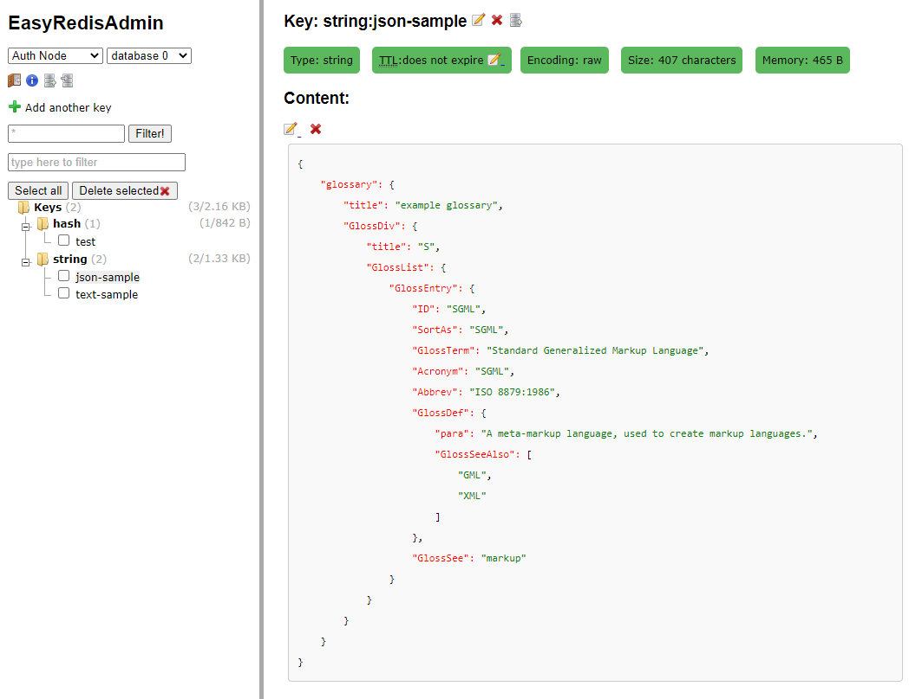

# EasyRedisAdmin
Make redis management easier. This project is for redis admin by php. [中文版说明](./README-CN.md)

This project is based on [erikdubbelboer/phpRedisAdmin](https://github.com/ErikDubbelboer/phpRedisAdmin) Ver1.11.5. phpRedisAdmin is a great project, thanks.

## Demo：

## What works did i do
* Estimated memory consumption for each key and folder.
* Remove Predis dependency, making it more efficient.
* Support json format.
* Add more information for each instance item.
* Refine UI.
* Refine code.

## Install
~~~
git clone https://github.com/pkuoliver/EasyRedisAdmin.git
~~~
or
~~~
wget https://github.com/pkuoliver/EasyRedisAdmin/archive/master.zip
unzip master.zip
~~~
After installed, you can copy includes/config.sample.inc.php and edit your instance information and longin info.

## TODO
* Optimize UI presentation and improve the convenience of CURD operations.
* Add real-time monitoring for each instance.
* Add multi-language support.